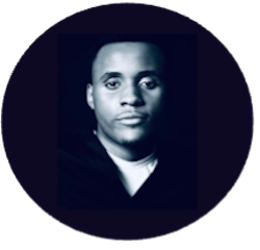

  

    
    <ul style="list-style-type: none; padding: 0; margin: 0; text-align: center;">
      <li>: <a href="">cyrille.mvomo@mail.mcgill.ca</a></li>
      <li>LinkedIn: <a href="http://www.linkedin.com/in/cyrille-mvomo">@cyrillemvomo</a></li>
      <li>GitHub: <a href="https://github.com/cyrillemvomo">@cyrillemvomo</a></li>
    </ul>
  

  

    <h1>About Me</h1>
    
Welcome to my website!

    
I'm a biomechanist and data scientist with over 2 years of diverse experience in both clinical and research settings. My expertise lies in supporting and developing digital health projects and products, harnessing the power of AI, data analytics, and technology in locomotion rehabilitation and orthopedics.

    
Currently, my research is centered around utilizing wearable sensing technologies to develop practical progression biomarkers for individuals living with Parkinson's disease.

    
I am presently pursuing a Ph.D. in Biomechanics & Neurosciences (Kin) under the mentorship of Dr. Paquette (primary supervisor) from the Human Brain Control of Locomotion Lab, McGill University, and Dr. Awai from the Data Analytics & Rehabilitation Technology Lab, LLUI. Additionally, I hold academic positions as a Lecturer at the University of Paris - AFREP Institute, and as a research committee member at the University of Paris - Department of Rehabilitation Sciences.

    
My journey has been enriched by immersive experiences, including a visiting graduate student researcher role at the School of Engineering of the Swiss Federal Institute of Technology (EPFL) with Dr. Bouri's REHAssist Group (BIOROB & TNE Labs). During this tenure, I contributed to the evaluation of an exoskeleton aimed at enhancing mobility.

    
My academic foundation includes a Bachelor's and Master's degree obtained from the University of Paris, with affiliations to AFREP Institute and CRI (now LPI), respectively.

    
Thank you for visiting my website.

  

